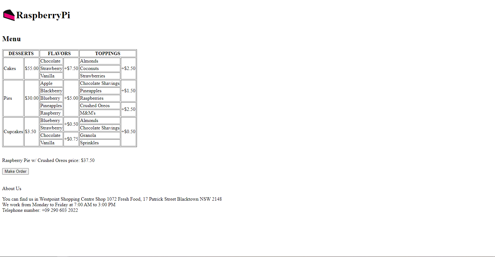
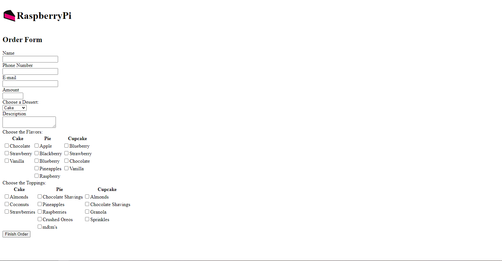
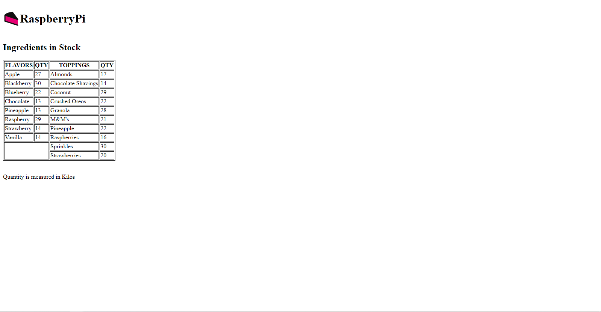
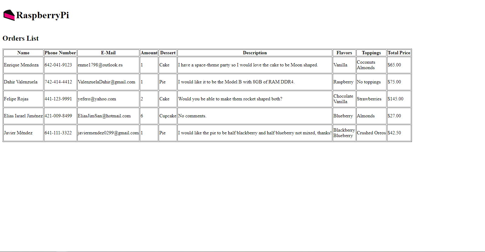

<!-- PROJECT LOGO -->
 

  

<h3 align="center">Launch X - Front-end HTML</h3>

  

    Assignment from the second week of Launch X's frontend introduction course
     
    <a href="https://github.com/javiermendez-coder/LaunchX-FrontEnd-01-html"><strong>Explore the docs »</strong></a>
     
     
    <a href="https://github.com/javiermendez-coder/LaunchX-FrontEnd-01-html/issues">Report Bug</a>
    ·
    <a href="https://github.com/javiermendez-coder/LaunchX-FrontEnd-01-html/issues">Request Feature</a>
  

<!-- TABLE OF CONTENTS -->

  
Table of Contents

  <ol>
    <li>
      <a href="#about-the-project">About The Project</a>
      <ul>
        <li><a href="#website-screenshots">Website Screenshots</a></li>
        <li><a href="#built-with">Built With</a></li>
      </ul>
    </li>
    <li><a href="#contact">Contact</a></li>
  </ol>

<!-- ABOUT THE PROJECT -->
## About The Project

The focus of this project is design html only web pages by a [given case][launchx-case]. Where our duty is create pages for the clients and cooks displaying info like: Menu, order form, ingredients in stock, and orders list.

(<a href="#top">back to top</a>)

### Site screenshot

User's webpages:

Cook's webpages:

(<a href="#top">back to top</a>)

### Built With

* HTML

(<a href="#top">back to top</a>)

<!-- CONTACT -->
## Contact

Javier Méndez - javiermendez0299@gmail.com

Project Link: [https://github.com/javiermendez-coder/LaunchX-FrontEnd-01-html](https://github.com/javiermendez-coder/LaunchX-FrontEnd-01-html)

(<a href="#top">back to top</a>)

<!-- MARKDOWN LINKS & IMAGES -->
[launchx-case]: https://github.com/LaunchX-InnovaccionVirtual/FrontEnd-Mision/tree/main/02%20-%20HTML/practicas